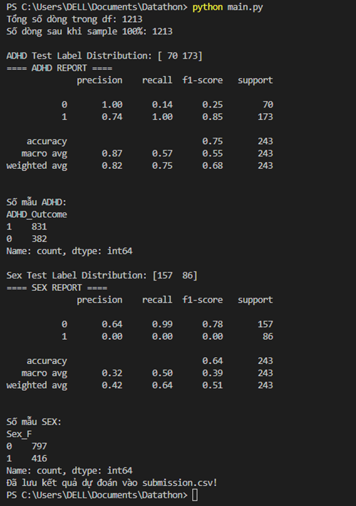
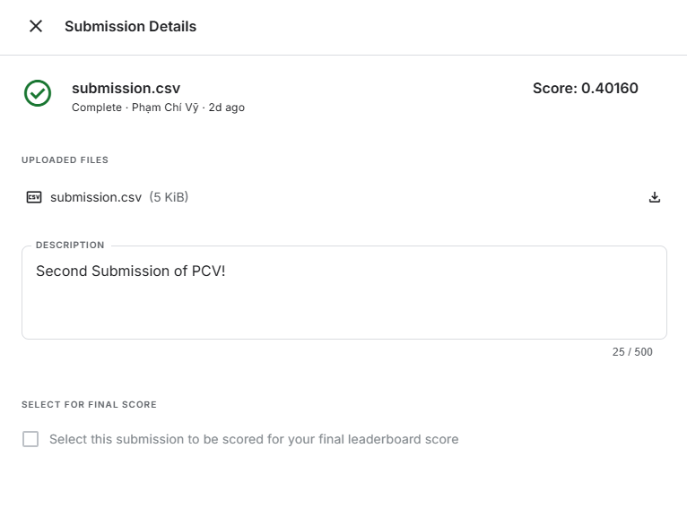

# Model 1

## Processing Pipeline

### 1. Data Reading and Preprocessing
- Use `pandas` to read data from `.xlsx` and `.csv`.
- Preprocessing:
  - **Behavioral data**: Impute (fill missing values with mean) and standardize.
  - **Demographic data**:
    - Split into 3 groups: numerical, ordinal, categorical.
    - Use a separate pipeline for each group:
      - Impute with mean/mode depending on the type.
      - Normalize or one-hot encode.
  - **fMRI data**: Impute + standardize + PCA to retain 95% variance.

### 2. Data Merging
- All datasets are merged using `participant_id`.
- Merge behavior, demographics, fMRI, and labels into a final dataframe.

### 3. Prepare Training Data
- Remove unnecessary columns like `participant_id`, `Sex_F`, or `ADHD_Outcome` depending on the task.
- Split into:
  - `X`: input features.
  - `y_adhd`: target label for ADHD prediction.
  - `y_sex`: target label for gender prediction.

### 4. Train the Model
- **Random Forest** is used for both tasks:
  - Predicting `ADHD_Outcome`.
  - Predicting `Sex_F`.
- Training and testing sets are split in an 80-20 ratio.
- Use `class_weight='balanced'` to deal with class imbalance.
- Print `classification_report` after prediction.

### 5. Predict Test Set
- Apply the exact same data processing pipeline as with the training set.
- Predict `ADHD_Outcome` and `Sex_F` for unlabeled samples.
- Export predictions to `submission.csv`.

## Requirements

```bash
pip install pandas numpy scikit-learn openpyxl
```

## Results



- Accuracy: 75%
- Class 1 (ADHD):
+ Precision = 74% (when model predicts ADHD, it's correct 74% of the time)
+ Recall = 100% (model catches almost all ADHD cases)
- Class 0 (Non-ADHD):
+ Precision = 100% (when model predicts non-ADHD, it's always right)
+ But Recall = 14% (!!) → the model almost ignores the non-ADHD group. 
➜ Model is very good at detecting ADHD (label 1) but extremely bad at detecting non-ADHD (label 0) due to class imbalance.
- Accuracy: 64%
+ Class 0 (Sex = 0): Precision = 64%, Recall = 99% → model favors class 0.
+ Class 1 (Sex = 1): Precision = 0%, Recall = 0% → model completely misses class 1. 
➜ Model always predicts 0 → totally ignores class 1.



## Một số phương pháp cải thiện model

- Resample the data.
- Choose better suited models: some models like XGBoost, LightGBM work well with imbalanced datasets.
- Evaluation metric: optimize for `f1-score` instead of `accuracy` in imbalanced label problems.
