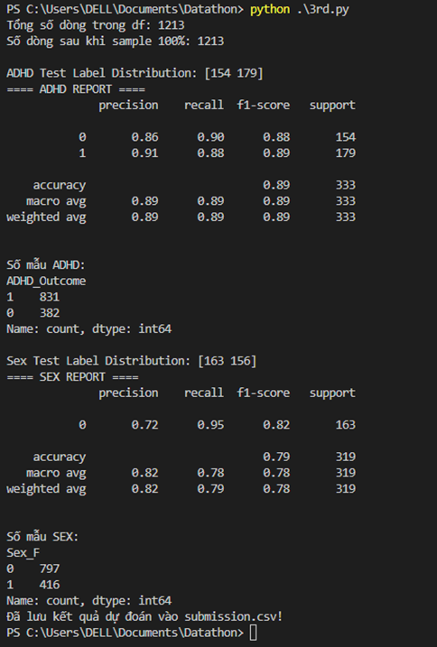
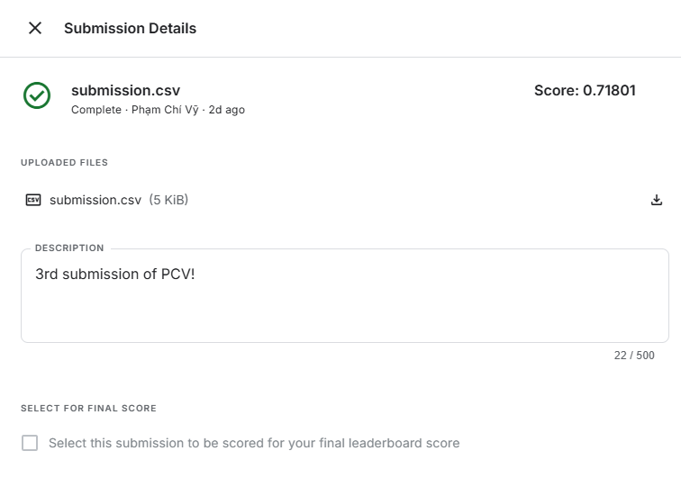
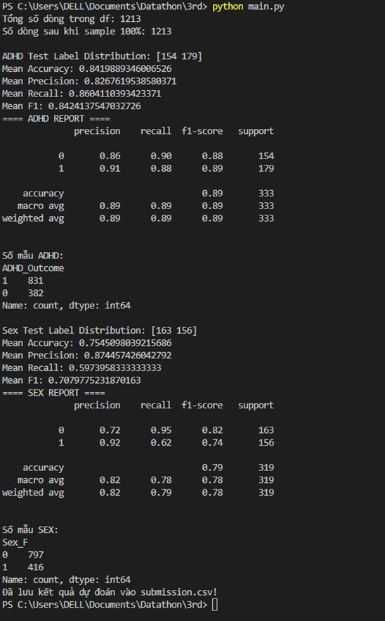

# Model 2

## Improvement over Model 1

- Data Balancing: SMOTE or other data augmentation techniques were used, resulting in a much more balanced dataset.
+ ADHD test label distribution: from [70 173] to [154 179]
+ Sex test label distribution: from [157 86] to [163 156]

## Requirements

```bash
pip install pandas numpy scikit-learn imbalanced-learn
```

## Results



- ADHD: Accuracy improved to 89%, with precision and recall both being quite consistent (≈ 88%–91%).
- Sex: Accuracy reached around 79%, showing significant improvement (previously, class 1 was always misclassified due to severe data imbalance).



## Several techniques to enhance the model

- Using Cross Validation (CV) helps models like Random Forest, XGBoost, etc., generalize better, rather than just fitting well on a single train/test split.


