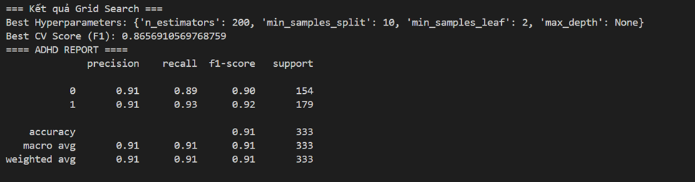
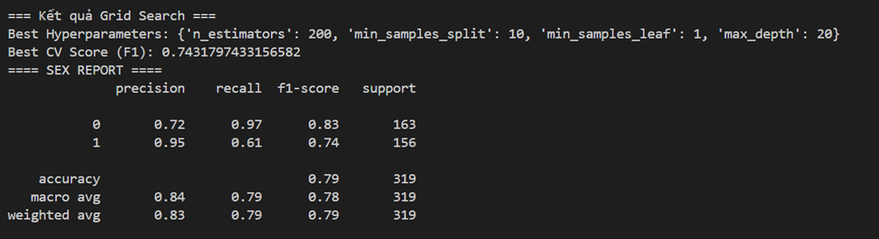
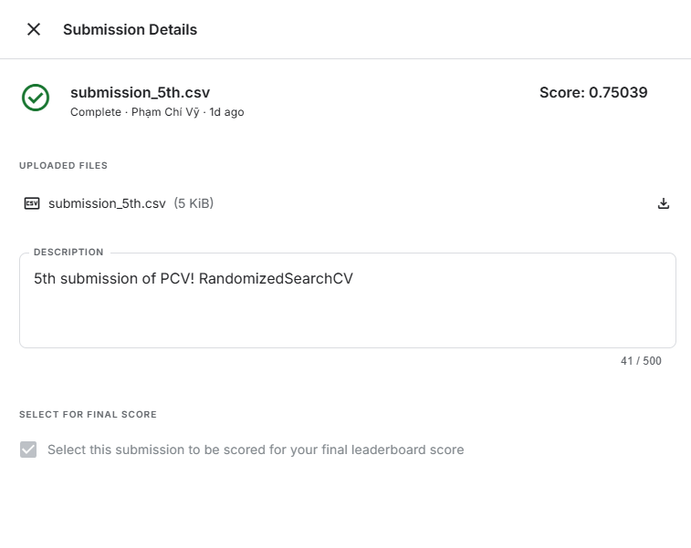

# Model 3

## Improvement over Model 2

- Using `RandomizedSearchCV` to find the optimal hyperparameters:
+ We applied `RandomizedSearchCV` to tune the hyperparameters of the Random Forest model, including `n_estimators`, `min_samples_split`, `min_samples_leaf`, and `max_depth`, based on the `f1-score`.

+ `RandomizedSearchCV randomly selects a predefined number` (`n_iter`) of parameter combinations from the given search space. For each combination, it performs `K-fold cross-validation`: the model is trained on `K-1` folds and evaluated on the remaining fold. The evaluation metric is defined by the scoring parameter (in this case, `f1-score`). The average score across all K folds is used as the cross-validation score for that combination.

+ The combination with the highest average F1-score across the folds is selected as the **best parameters**.

## Requirements

```bash
pip install pandas numpy scikit-learn imbalanced-learn
```

## Results




- The evaluation metrics of both the ADHD and Sex models, including precision, recall, and F1-score, have all improved. 
- Notably, on the Kaggle dataset, the score increased from 0.71801 to 0.75039.



## Several techniques to enhance the model

- MRI data is preprocessed and fed into a separate model, then the results are ensembled.
- An autoencoder is used instead of PCA to handle nonlinear data more effectively.
- Use XGBoost instead of Random Forest. 

