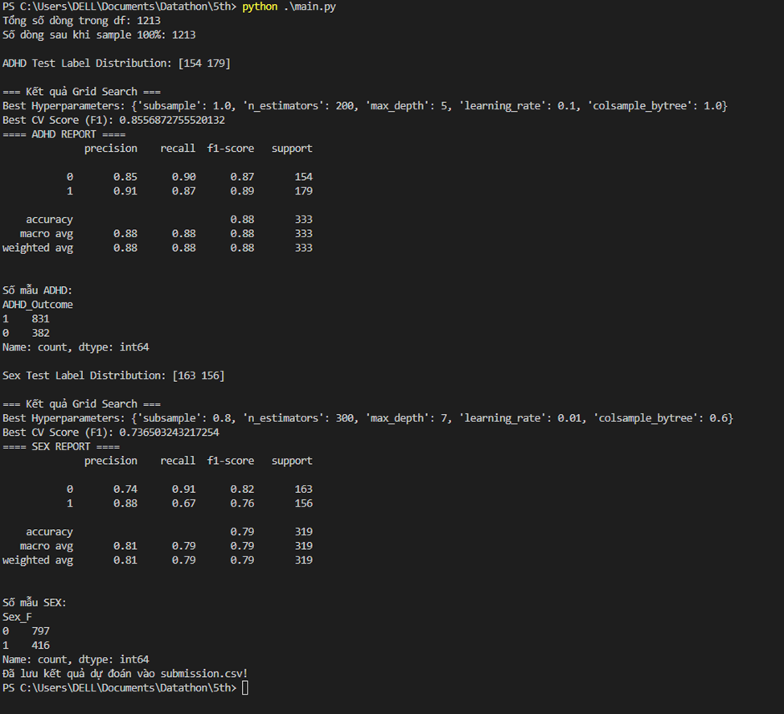
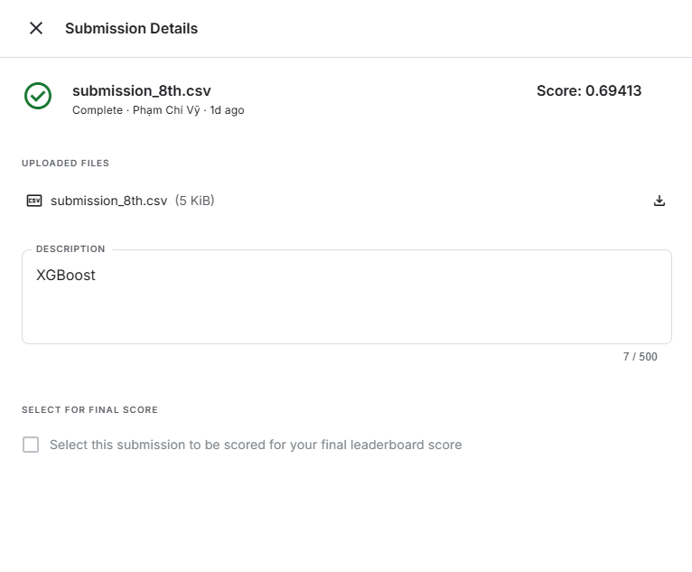

# Model 4

## Improvement over Model 2

- Using `XGBoost` instead of `Random Forest`.
- XGBoost is a sequential model, where each new tree corrects the errors of the previous ones.
It handles class imbalance using the `scale_pos_weight` parameter. However, it is prone to overfitting if not properly regularized and involves more hyperparameters to tune compared to some other models.

## Requirements

```bash
pip install pandas numpy scikit-learn imbalanced-learn xgboost 
```

## Results



- ADHD Prediction:
+ XGBoost (F1-score): 0.89 for class 1, 0.87 for class 0 → average ~0.88
+ Random Forest F1-score: ~0.89 → XGBoost has not outperformed it.
- Sex Prediction: XGBoost struggles with class 1: Recall is only 0.67



## Several techniques to enhance the model

- MRI data is preprocessed and fed into a separate model, then the results are ensembled.
- An autoencoder is used instead of PCA to handle nonlinear data more effectively.


