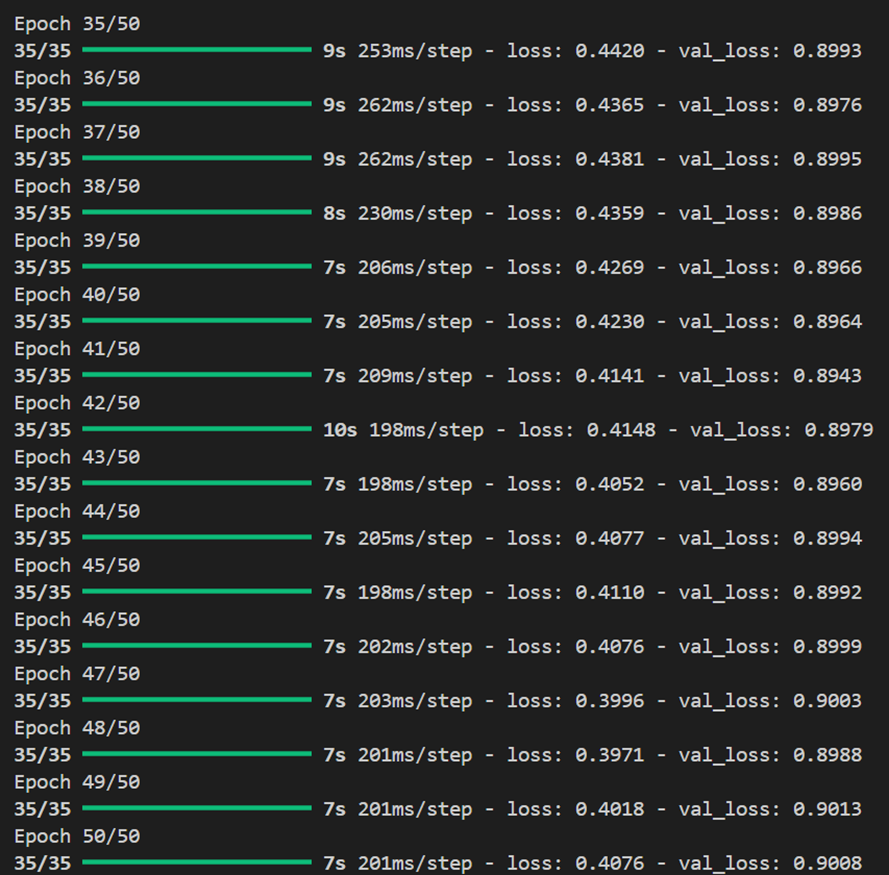
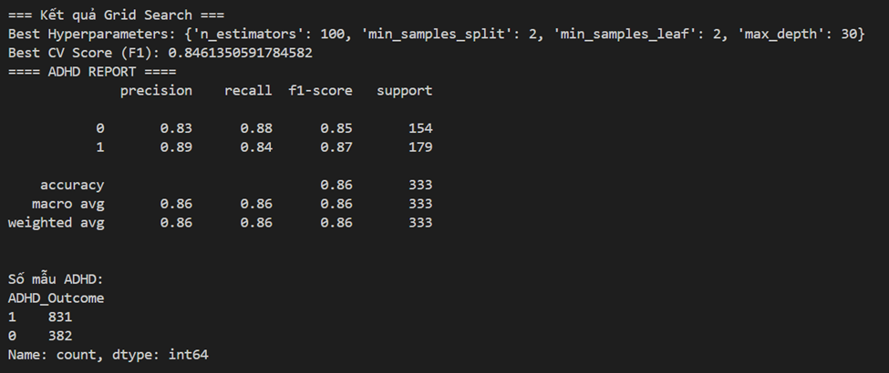
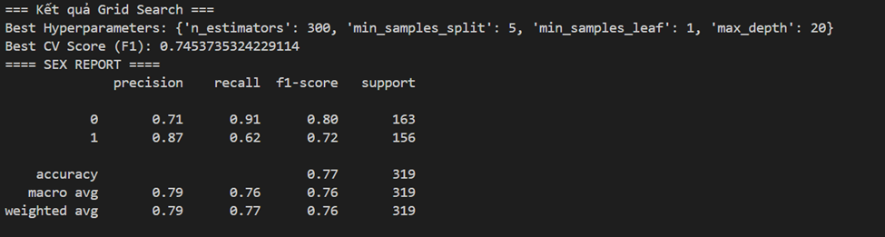
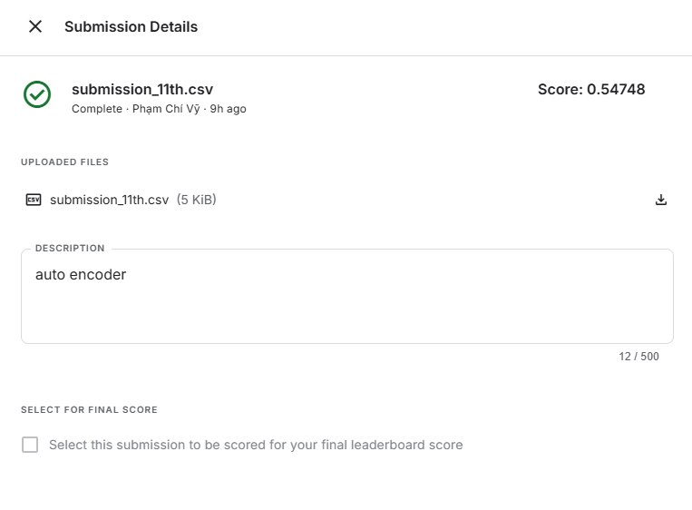

# Model 4

## Improvement over Model 2

- Using `Auto Encoder` instead of `PCA`.
- An Autoencoder is a nonlinear model when activation functions are used.
It learns to encode and decode data, effectively compressing and reconstructing it.
It performs well on large and complex datasets.

## Requirements

```bash
pip install pandas numpy scikit-learn imbalanced-learn tensorflow  
```

## Results







- ADHD Prediction:
+ XGBoost (F1-score): 0.89 for class 1, 0.87 for class 0 → average ~0.88
+ Random Forest F1-score: ~0.89 → XGBoost has not outperformed it.
- Sex Prediction: XGBoost struggles with class 1: Recall is only 0.67



## Several techniques to enhance the model

- MRI data is preprocessed and fed into a separate model, then the results are ensembled.
- An autoencoder is used instead of PCA to handle nonlinear data more effectively.


