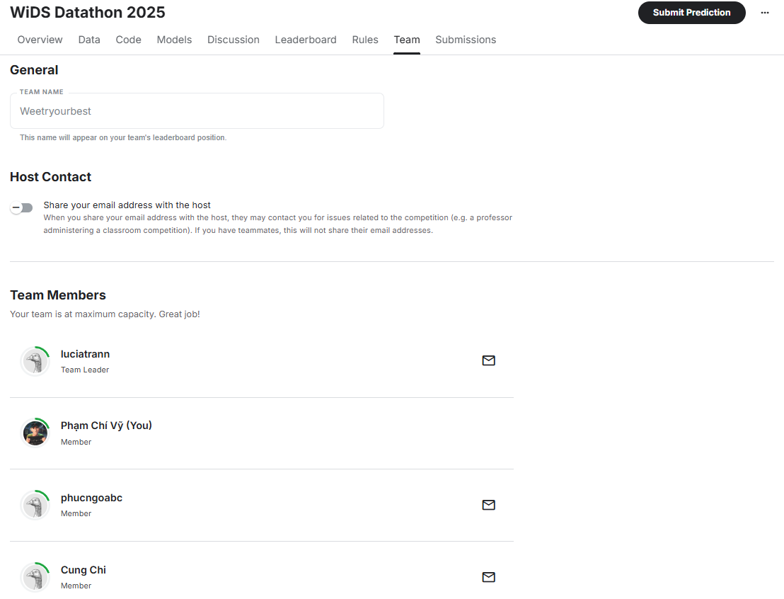
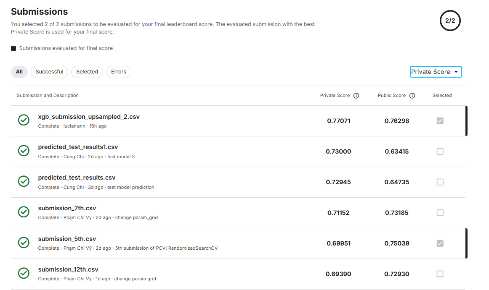
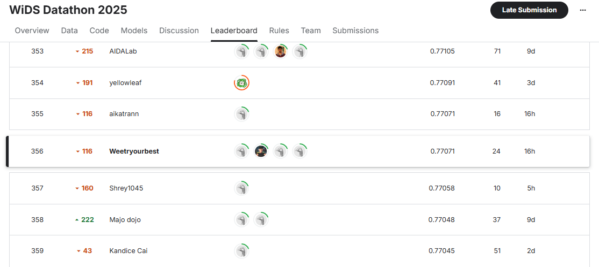

# WiDS Datathon 2025 - ADHD & Sex Prediction from Brain and Metadata

For more details, visit the [WiDS Datathon 2025](https://www.kaggle.com/competitions/widsdatathon2025).

## Description

This project aims to build machine learning models to predict two main labels using fMRI data and metadata:

- ADHD_Outcome: Predict the likelihood of having ADHD.
- Sex_F: Predict gender (female/male encoded).

The provided dataset includes:

- Behavioral data: Quantitative behavioral indicators.
- Demographic data: Demographic information.
- fMRI connectome matrices: Functional brain connectivity matrices.
- Labels: Target labels for the training set samples.

## Team 

- Although we only worked during the last 11 days before the model submission deadline, the whole team achieved great results.

- My individual model reached an accuracy of 0.75039, and it was one of the two models selected for the final team submission.

## Caution 

- Make sure to update the data paths in all code sections accordingly.

## Results

